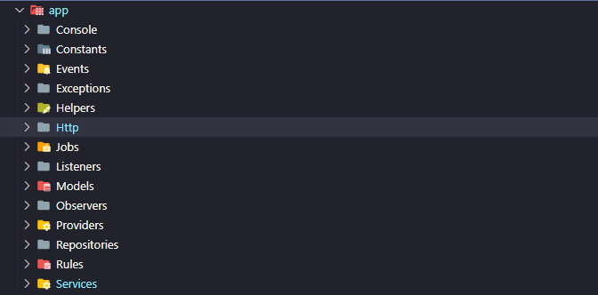

<h1 align="center">PicPay Transactions</h1>

<p>
    <a href="#Instalação">Instalação</a>
    <a href="#Endpoint">Endpoint</a>
    <a href="#Estrutura da Aplicação">Estrutura da Aplicação</a>
</p>

## 🚀 Instalação

#### Pré-requisitos

Antes de começar, certifique-se que você tem o Docker instalando na sua máquina.

```bash
# Clone este repositório
$ git clone git@github.com:rafaelzorn/picpay-transactions.git

# Acesse a pasta docker que está na raiz do projeto
$ cd docker

# Execute o script installer.sh
$ ./installer.sh
```

Ao executar o script ``installer.sh`` ele irá executar os seguintes comandos:

- docker-compose up -d
- docker exec picpay-transactions-api cp .env.example .env
- docker exec picpay-transactions-api composer install --ignore-platform-req=php
- docker exec picpay-transactions-api php artisan migrate
- docker exec picpay-transactions-api php artisan db:seed
- docker exec picpay-transactions-api vendor/bin/phpunit tests/Unit/ --testdox
- docker exec picpay-transactions-api vendor/bin/phpunit tests/Integration/ --testdox
- docker exec picpay-transactions-api php artisan queue:listen

## 🌎 Endpoint

```
    http://localhost:8000/api/v1/transactions/transfer
```

##### Exemplos Payload

```
    # Transferência de usuário para usuário
    {
	    "payer_document": "48267677062",
	    "payee_document": "81347820000",
	    "value": 1.00
    }

    # Transferência de usuário para lojista
    {
	    "payer_document": "81347820000",
	    "payee_document": "70915585000155",
	    "value": 1.00
    }
```

## 📂 Estrutura da Aplicação


