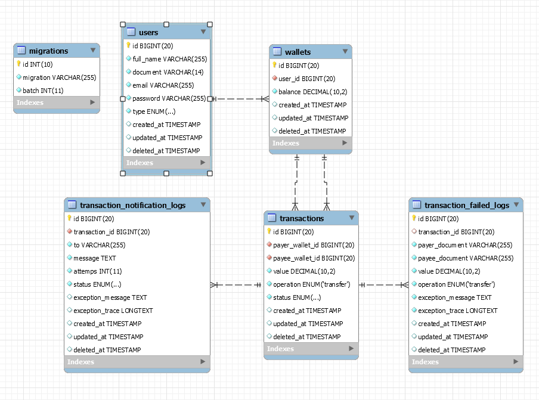
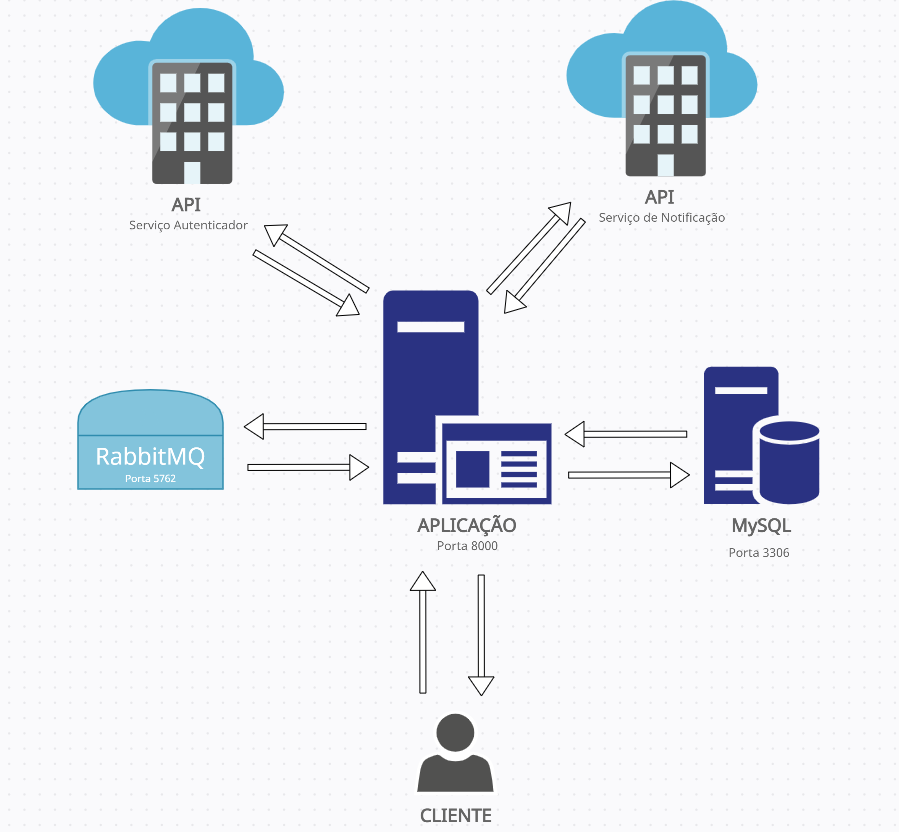
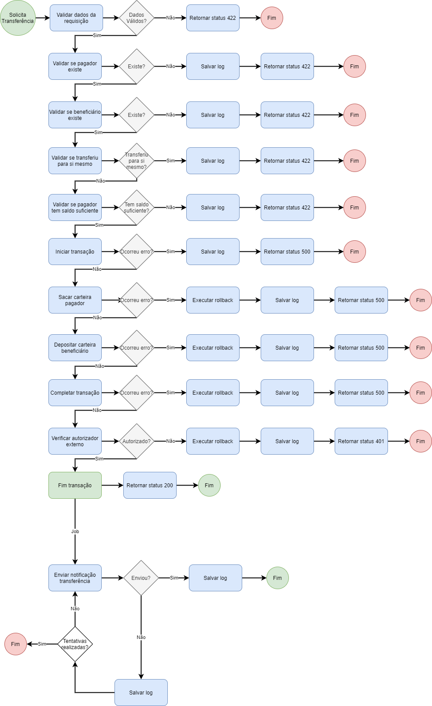

<h1 align="center">PicPay Transactions</h1>

Desafio técnico Backend - PHP retirado do [repositório oficial do PicPay ](https://github.com/PicPay/picpay-desafio-backend) para fins de estudo.

##

* [Instalação](#Instalação)
* [Endpoint](#Endpoint)
* [Estrutura da Aplicação](#estrutura-da-aplicação)
* [Diagrama ER](#diagrama-er)
* [Arquitetura](#arquitetura)
* [Fluxograma](#fluxograma)
* [Tecnologias Utilizadas](#tecnologias-utilizadas)

## Instalação

#### Pré-requisitos

Antes de começar, certifique-se que você tem o Docker instalando na sua máquina.

```bash
# Clone este repositório
$ git clone git@github.com:rafaelzorn/picpay-transactions.git

# Acesse a pasta docker que está na raiz do projeto
$ cd docker

# Execute o script installer.sh
$ ./installer.sh
```

Ao executar o script ``installer.sh`` ele irá executar os seguintes comandos:

- docker-compose up -d
- docker exec picpay-transactions-api cp .env.example .env
- docker exec picpay-transactions-api composer install --ignore-platform-req=php
- docker exec picpay-transactions-api php artisan migrate
- docker exec picpay-transactions-api php artisan db:seed
- docker exec picpay-transactions-api vendor/bin/phpunit tests/Unit/ --testdox
- docker exec picpay-transactions-api vendor/bin/phpunit tests/Integration/ --testdox
- docker exec picpay-transactions-api php artisan queue:listen

## Endpoint

```
    http://localhost:8000/api/v1/transactions/transfer
```

##### Exemplos Payload

```
    # Transferência de usuário para usuário
    {
	    "payer_document": "48267677062",
	    "payee_document": "81347820000",
	    "value": 1.00
    }

    # Transferência de usuário para lojista
    {
	    "payer_document": "81347820000",
	    "payee_document": "70915585000155",
	    "value": 1.00
    }
```

## Estrutura da Aplicação


##### Controllers
- TransferController

##### Jobs
- TransferNotificationJob

##### Models
- Transaction
- TransactionFailedLog
- TransactionNotificationLog
- User
- Wallet

##### Observers
- UserObserver

##### Repositories
- BaseRepository
- TransactionRepository
- TransactionFailedLogRepository
- TransactionNotificationLogRepository
- UserRepository
- WalletRepository

##### Requests
- TransferHandleRequest

##### Resources
- TransferResource

##### Rules
- DocumentRule
- ShopkeeperDoesNotTransferRule

##### Services
- ExternalAuthorizerService
- ExternalNotificationService
- TransferService

## Diagrama ER



## Arquitetura



## Fluxograma



## Tecnologias Utilizadas

- [Lumen 8.0](https://lumen.laravel.com/)
- [Guzzle](https://github.com/guzzle/guzzle)
- [RabbitMQ](https://www.rabbitmq.com/)
- [RabbitMQ Queue driver for Laravel](https://github.com/vyuldashev/laravel-queue-rabbitmq)
